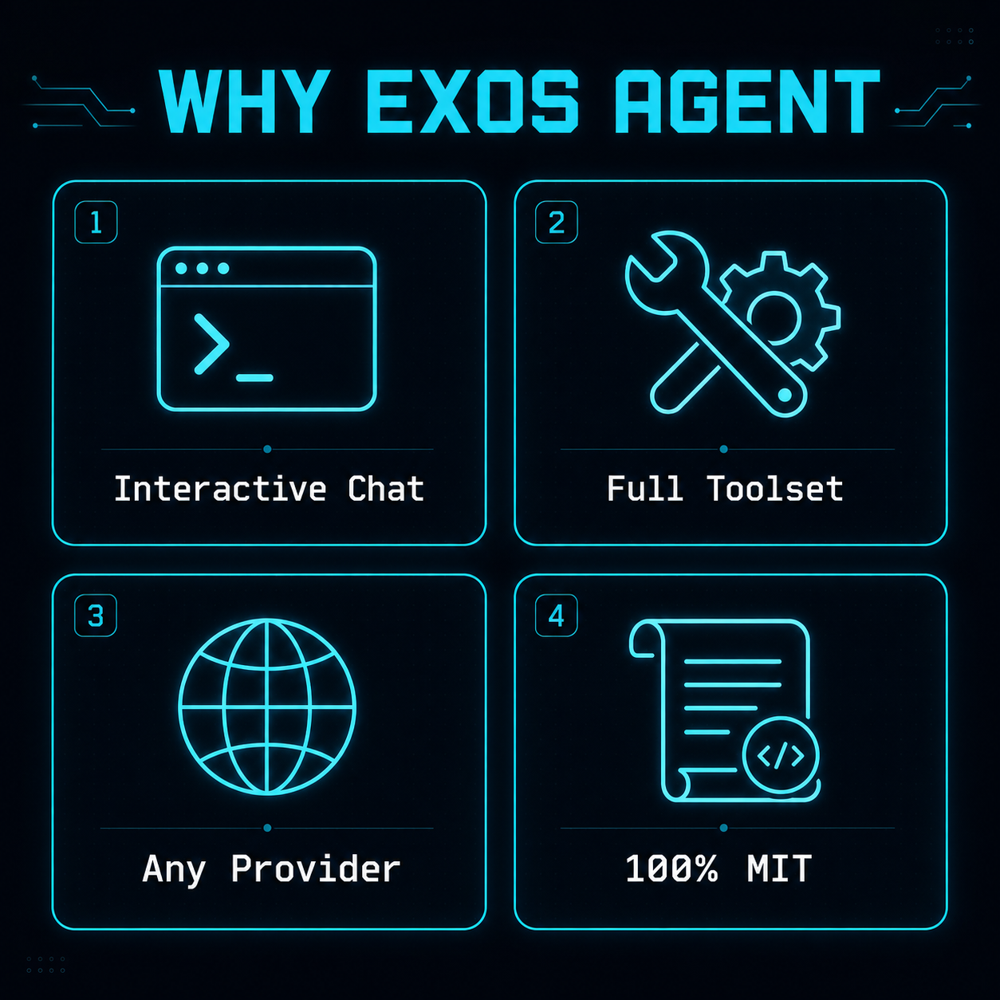

<p align="center">
  
</p>

<p align="center">
  <a href="https://github.com/BlackXV2vip/exos/releases"></a>
  <a href="LICENSE"></a>
  <a href="https://t.me/HackerExos_VIP"></a>
  <a href="https://t.me/HackerExos"></a>
</p>

# EXOS AGENT

**Exos Agent** — وكيل برمجة بالذكاء الاصطناعي شغال من الترمينال: بيتكلم معاك شات تفاعلي حقيقي، وبيكتب ويعدّل ملفات مشروعك بنفسه، وبيدوّر في الكود، وبيشغّل أوامر، وبيجيب معلومات من الويب — وبيفتكر المحادثة كلها. مفتوح المصدر 100% برخصة MIT، ومعاه **جسر مجاني جاهز**: حمّل واشتغل في 5 دقايق من غير أي API key 🔥

**Exos Agent** — an AI coding agent for the terminal: interactive chat with session memory, full tool access (read/write/search/bash/web), custom themes, and TUI interfaces. Ships with a **free ready-made bridge** — download and start in 5 minutes, no API key needed. 100% open source under the MIT license.

<p align="center">
  
</p>

<p align="center">
  
</p>

<p align="center">
  <sub>🎥 جلسة حقيقية مسجلة — مش تمثيل: ذاكرة محادثة بالعربي + تنفيذ أدوات مباشر · Real recorded session: Arabic chat memory + live tool execution</sub>
</p>

```
                                   ▄
█▀▀ █ █ █▀█ █▀▀ █▀█ █▀▀ █▀▀ █▀█ ▀█▀
█▀   █  █ █ ▀▀█ █▀█ █▀█ █▀  █ █  █
▀▀▀  ▀  ▀▀▀ ▀▀▀ ▀ ▀ ▀▀▀ ▀▀▀ ▀ ▀  ▀
```

## ✨ المميزات | Features

### 🇪🇬 بالعربي

- 💬 **شات تفاعلي** (`exos-agent chat`) — محادثة حقيقية رايح جاي، بيفتكر اسمك وكلامك طول الجلسة.
- ⚡ **تنفيذ حقيقي مش وعود** — يكتب ملفات، يعدّل كود، يشغّل أوامر، يشوف النتيجة ويكمّل على أساسها.
- 🔍 **بحث في مشروعك كله** — glob/grep بالريجيكس لأي عمق، حتى الملفات المخفية.
- 🌐 **ويب مدمج** — يجيب صفحات ويفتش عن أحدث المعلومات بنفسه.
- 🖥️ **واجهة TUI كاملة** بثيم Exos مخصوص — ماركداون، diffs، وإدارة جلسات.
- 💾 **جلسات ذكية** — استكمل آخر محادثة (`chat --continue`) أو ارجع لأي جلسة قديمة.
- 🆓 **جسر مجاني مدمج** (`exos_adapter.py`) — من غير مفاتيح API ولا اشتراكات.
- 🔌 **يدعم أي مزود OpenAI-compatible** — OpenAI، موديلات محلية، أي endpoint.

### 🇬🇧 English

- **Interactive chat in the terminal** (`exos-agent chat`) — real back-and-forth conversation with session memory.
- **Rich TUI** (`exos-agent`) — full-screen terminal UI with custom Exos theme, markdown rendering, diffs, and session management.
- **One-shot runs** (`exos-agent run "..."`) — for scripts and CI.
- **Full toolset**: file read/write/edit, glob/grep search, bash execution, todos, web fetch & web search, sub-agents.
- **Free included bridge** (`exos_adapter.py`) — start with zero API keys; any OpenAI-compatible provider works too.
- **Sessions** — resume, fork, and search past conversations (`--continue`, `--session`).

## 🚀 Quick start

📖 **Full step-by-step guide (عربي + English): [QUICKSTART.md](QUICKSTART.md)** — download → bridge → config → chat in 5 minutes.

### ⚡ أمر واحد وخلاص | One-command install (Linux x64)

```bash
curl -fsSL https://raw.githubusercontent.com/BlackXV2vip/exos/main/install | bash
```

بيسطّب الباينري (مع تحقق SHA256) + الجسر المجاني + الكونفيج، وبعدها: `exos-bridge` في تيرمينال و `exos-agent chat` في تيرمينال تاني 🎉
*It installs the binary (SHA256-verified) + free bridge + ready config. Then: `exos-bridge` in one terminal, `exos-agent chat` in another.*

### 🛠️ يدوي | Manual

```bash
# 1) download the release binary (Linux x64)
curl -L -o exos-agent.tar.gz \
  https://github.com/BlackXV2vip/exos/releases/download/v1.18.5/exos-agent-linux-x64.tar.gz
tar xzf exos-agent.tar.gz && chmod +x exos-agent

# 2) start the included free bridge (any OpenAI-compatible provider works too)
pip3 install requests pycryptodome
python3 exos_adapter.py          # serves http://127.0.0.1:8791/v1

# 3) one-time config
mkdir -p ~/.config/exos-agent
cp examples/exos-agent.json ~/.config/exos-agent/exos-agent.json

# 4) go 🎉
./exos-agent chat                 # interactive chat (شات تفاعلي)
./exos-agent run "explain this repo"   # one-shot agentic task
./exos-agent                      # full-screen TUI
```

## ⚙️ Configuration

`~/.config/exos-agent/exos-agent.json`:

```json
{
  "provider": {
    "my-provider": {
      "npm": "@ai-sdk/openai-compatible",
      "options": { "baseURL": "http://127.0.0.1:8787/v1", "apiKey": "public" },
      "models": { "my-model": { "name": "My Model", "tools": true } }
    }
  },
  "model": "my-provider/my-model",
  "theme": "exos"
}
```

Custom themes live in `~/.config/exos-agent/themes/<name>.json`.

## 🏗️ Build from source

Requires [Bun](https://bun.sh):

```bash
git clone <this repo>
cd exos-repo
bun install
cd packages/exos-agent
EXOS_AGENT_VERSION=1.18.4 EXOS_AGENT_CHANNEL=latest \
  bun run script/build.ts --single --skip-embed-web-ui
# binary: packages/exos-agent/dist/exos-agent-linux-x64/bin/exos-agent
```

## 📦 Repository layout

| Path | ما بيحتوي |
|---|---|
| `packages/exos-agent` | CLI, agent loop, tools, server |
| `packages/tui` | Terminal UI (OpenTUI), themes, logo |
| `packages/core` | sessions, catalog, providers |
| `packages/protocol` | wire protocol & event schemas |
| `packages/vendor/*` | vendored & rebranded auth/provider plugins (GitLab, Poe, gitlab-ai-provider) |
| `packages/sdk` `packages/ui` `packages/server` … | SDK, shared UI, server pieces |

## 👨‍💻 المطور | Developer

**HackerExos** — مطوّر ومالك مشروع Exos Agent · owner & developer of Exos Agent

| | |
|---|---|
| 📢 **قناة التليجرام** — تحديثات، إصدارات جديدة، ودعم مباشر | 👉 **[t.me/HackerExos_VIP](https://t.me/HackerExos_VIP)** |
| 💬 **تواصل مباشر مع المطور** | 👉 **[@HackerExos](https://t.me/HackerExos)** |

## 📄 License

MIT — see [LICENSE](LICENSE).

---

<p align="center">
  صُنع بـ 🔥 بواسطة <a href="https://t.me/HackerExos"><b>HackerExos</b></a>
  ·
  انضم لقناة التليجرام: <a href="https://t.me/HackerExos_VIP"><b>@HackerExos_VIP</b></a>
</p>
